# Proyecto Final de IOS
El proyecto consiste en mostrar información de los sitios favoritos que el usuario agrega a la aplicación, la APP muestra el estado del tiempo, contaminación y predicciones de tiempo en los siguientes dias, la aplicación tambien permite agregar localidades mediente una búsqueda del poblado en mapas de Apple. Toda la información del clima, contaminación y pronótico del tiempo, es recolectado mediante el consumo de servicios proporcionado por OpenWeather (  <a href="https://openweathermap.org">Enlace</a> )

La figura siguiente muestra la primera vista al abrir la aplicación, al inicio por defecto se muestra la información del estado del clima de Ciudad Universitaria.

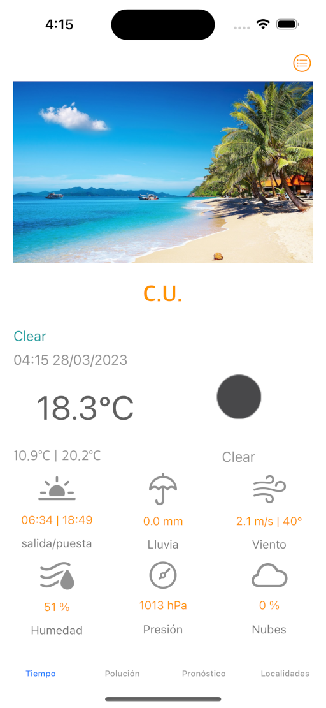

La aplicación se navega mediante cuatro taps: 
- Tiempo:  Muestra información del estado del tiempo mas actual
- Calidad del aire, que muestra información sobre calidad del aire de la ciudad seleccionada
- Pronóstico: Muestra el pronóstico del tiempo de la ciudad de la ciudad seleccionada
- Localidad: Muestra las localidades registradas para poder visualizar sus condiciones metereológicas

## Tiempo
En este pagina se muestran el estado del tiempo donde se muestra información de temperatura, puesta y salida del sol, velocidad y dirección del viento, humedad, presión y nubosisdad. Este apartado tiene un botón en l parte superior donde se puede seleccionar una ciudad para mostrar el estado del clima. Cuando no hay ciudades registradas se muestra por defecto el estado del tiempo de C.U.

## Polución

Esta sección muestra información del índice de calidad del aire, muestra información sobre condiciones de monóxido de carbono (CO), Ozono (O3), Dióxido de azufre (S02), Dióxido de nitrógeno (NO2), particulas final (PM2.5) y particulas suspendidas gruesas (PM10). La siguiente figura muestra la vista de esta sección

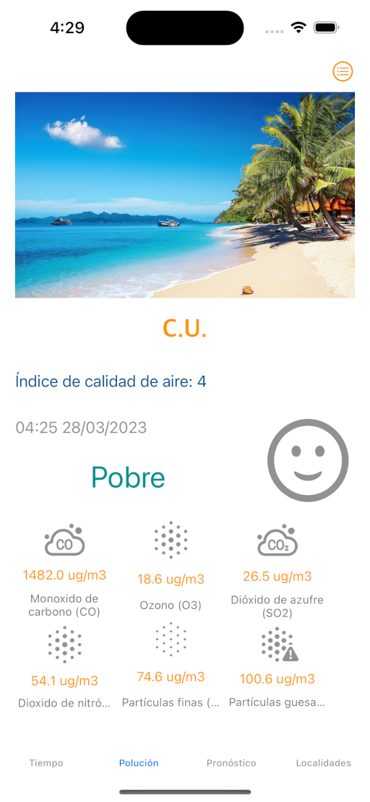

## Pronóstico
Esta sección muestra el pronóstico del tiempo a lo largo de las siguientes horas y dias de la localidad seleccionada, se incluye información de cada tres horas sobre wl pronóstico, temperatura, humedad y presión (ver la siguiente figura)

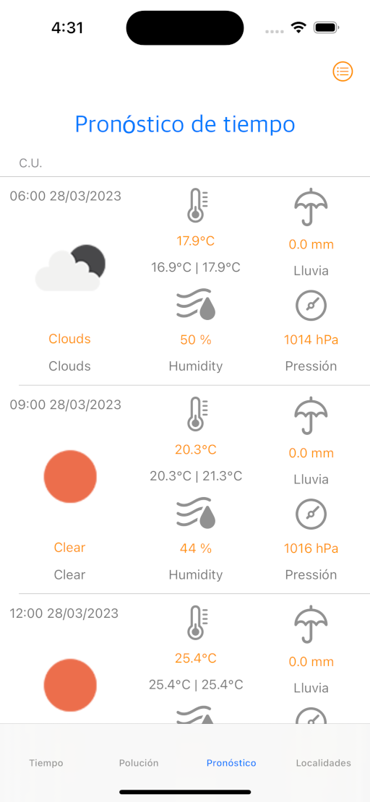

## Localidad
En esta página se puede registar los lugares deseados para mostrar información del estado del tiempo. La siguiente figura muestra la página inicial cualdo no se ha agregado ninguna localidad 

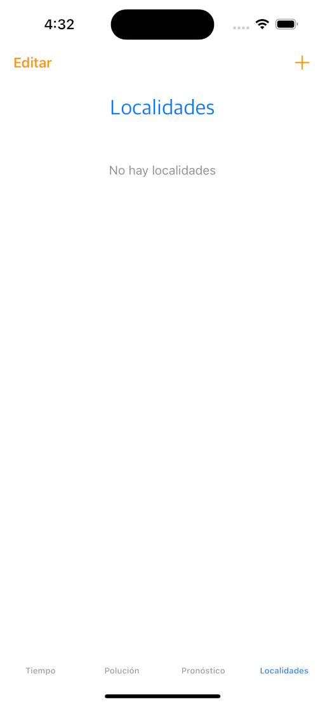{width=40px}

### Agregar Localidad

Para agregar una localidad se debe presionar el botón (+) naranja que se encuentra en la parte inferior, lo que mostrará una partalla para registra información detallada de las localidades como: nombre, estado, pais, latitud, longitud, así como alguna descripción del lugar.

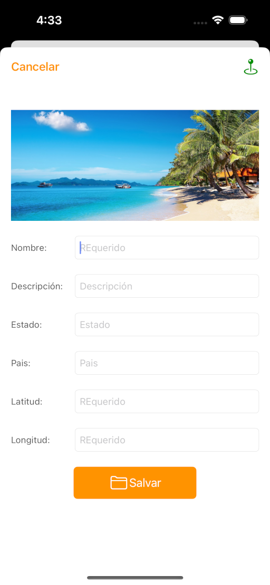

Si uno desea hacer una búsqueda en el mapa de Apple, se debe hacer clic en el botón de localizar que se enuentra en la parte superior derecha, lo que aparecerá la siguiente vista, del mapa de la república mexicana

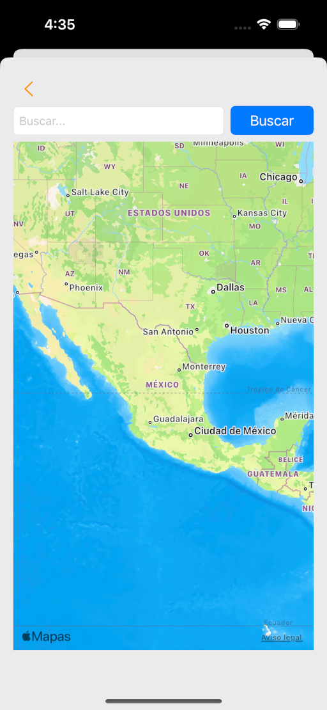

En la parte superior se encuentra un campo donde se puede escribir una localidad para encontrar su ubicación geoespacial. Por ejemplo al buscar el centro de la Ciudad de México se obtiene la siguiente imagen

Para concluir la búsqueda se hace clic en la frecha hacia atras colocada en la esquina superior izquierda. 

Con la información encontrada, automáticamente se rellenarán los campos como se muestra en la siguiente figura. 

Finalmente se debe apretar el botón guardar para que esta nueva ubicación sea registrada en el dispositivo.

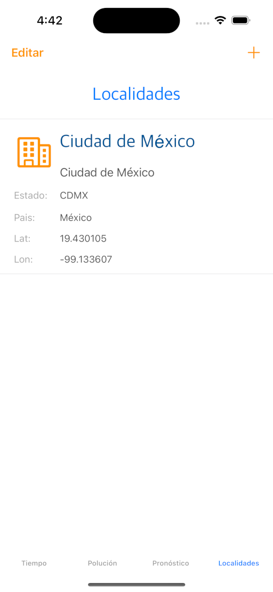

### Borrar Localidad

Existen dos formas para borrar la actividad, la primera y mas simple es deslizar una localidad hacia la parte izquierda y aparecerá un botón para eliminarla. La segunda opción es hacer clic en el botón editar y se podra seleccionar una localidad para borrarla. La siguiente image, muestra la primera opción.

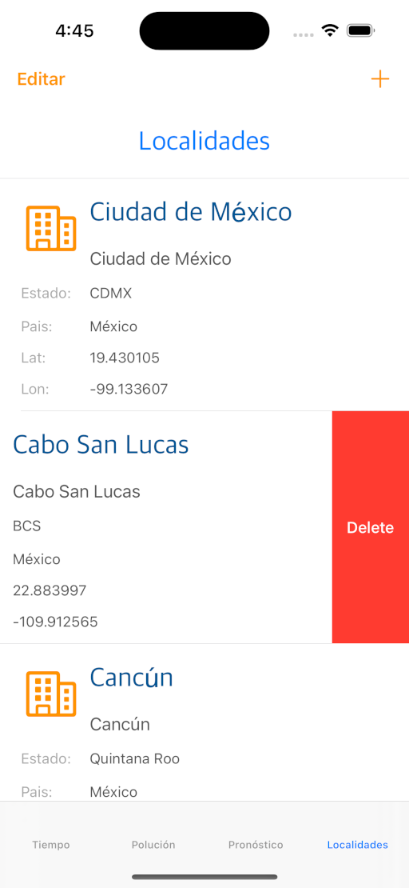

## Seleccionar una localidad para mostrar el estado de tiempo

En la parte superior en cualquiera de las primeras tres páginas se muestra un boton para abrir una lista con las localidades registradas y donde se puede seleccionar la localidad que se desea mostrar su información del estado del tiempo 

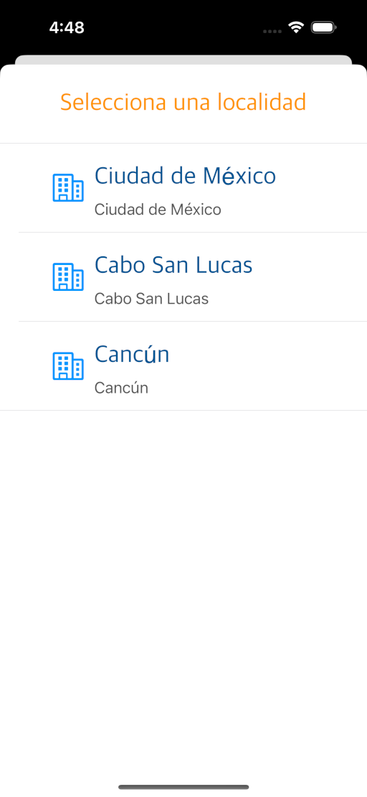

Finalmente se debe hacer clic en una de ellas y regresar a la vista previa para que se muestre información de la nueva ubicación.

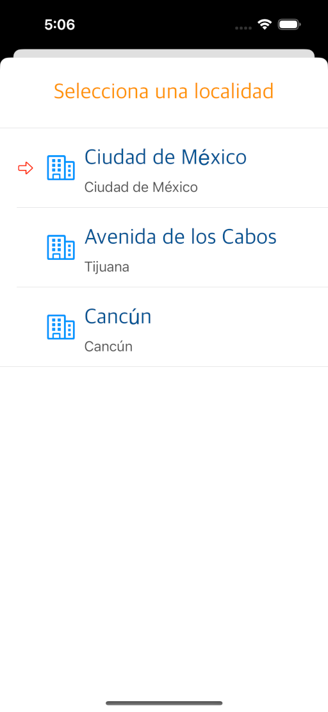

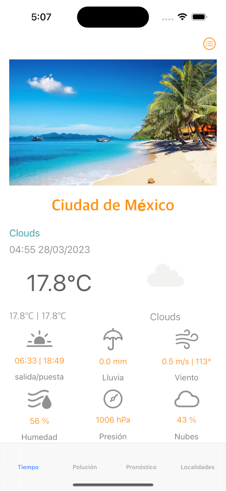

Elaborado por:
Omar Nieto Crisóstomo
omar.nieto@gmail.com
